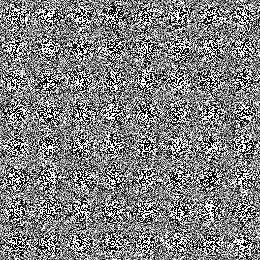

# High Performance Game of Life
This repository includes four diffrent implementations of [Conway's Game of Life](https://en.wikipedia.org/wiki/Conway%27s_Game_of_Life) and is my final project for CS5030: High Performance Computing. 



## Building
I have supplied a `build.sh` script to build all the diffrent executables. Alternativly you can build all four individualy. The individual build instructions can be found in the coresponding sourse file.


## Implementation
All implementations are based off of a shared data structure who's definition can be found in `game_of_life.h` and `game.c`. The data structure stores three internal buffers: one for the current game board, one for the next iteration of the game board, and a video frame buffer. All implementations write `.ppm` format as their video frames to standard out. This can either be written to a file or piped to a program like mpi. As an example I can either save the output like so:

```
    $ ./serial_game rand 256 256 50 50 600 > game.ppm
```

Or I can pipe it into mpi:

```
    $ ./serial_game rand 256 256 50 50 600 | mpv --no-correct-pts --fps=60 -
```

This approach was inspired by [Render Multimedia in Pure C](https://nullprogram.com/blog/2017/11/03/) by Chris Wellons where he explains this method. 

### Serial approach: `serial_game.c`
All other approaches to this problem were mostly modifications to this general approach, so a lot of time went into tweeking and fine tuning this to work better. Initialy I used board buffers of size width x height, however I found this to be slow and difficult to work with. Firstly, counting the sourounding cells required complex bounds checking which was slow and difficult to reason about. Secondly I wanted to implement a torous topology for the board so that a glider moving from the bottom of the screen could pop out of the top. 

The solution I found for this problem was incresing the size of the width and height by 2 so that the "real" board sat on the inside of a larger board. While I didn't end up implementing the torous topology for all implementations, I was still able to use this setup to prevent the need for bounds checking. A definition in `game_of_life.h` called `DO_TORIS` enables or disables this feature for any implementations that support it.

The next issue I came accros was an I/O bottleneck. Initialy I was writing the bytes one at a time and periodicly flusing. This, of course, was exceptionaly slow. I eventualy found that writing the bytes to an intermediate video buffer and then using `fwrite` to write them all at once was much faster and completly overcame the I/O bottleneck.

Below are some of the timing plots for this implementation. All the timing studies that are contained here were run on my laptop with an 8 core, 16 thread Intel i7-10875H 2.300GH cpu and a NVIDIA Quadro RTX 5000 Mobile gpu.

### Shared memory approach with OpenMP: `omp_game.c`
