# High Performance Game of Life
This repository includes four diffrent implementations of [Conway's Game of Life](https://en.wikipedia.org/wiki/Conway%27s_Game_of_Life) and is my final project for CS5030: High Performance Computing. 


## Building
I have supplied a `build.sh` script to build all the diffrent executables. Alternativly you can build all four individualy. The individual build instructions can be found in the coresponding sourse file.


## Implementation
All implementations are based off of a shared data structure who's definition can be found in `game_of_life.h` and `game.c`. The data structure stores three internal buffers: one for the current game board, one for the next iteration of the game board, and a video frame buffer. All implementations write `.ppm` format as their video frames to standard out. This can either be written to a file or piped to a program like mpi. As an example I can either save the output like so:

```
    $ ./serial_game rand 256 256 50 50 600 > game.ppm
```

Or I can pipe it into mpi:

```
    $ ./serial_game rand 256 256 50 50 600 | mpv --no-correct-pts --fps=60 -
```

This approach was inspired by [Render Multimedia in Pure C](https://nullprogram.com/blog/2017/11/03/) by Chris Wellons where he explains this method. 

### Serial approach: `serial_game.c`
All other approaches to this problem were mostly modifications to this general approach, so a lot of time went into tweeking and fine tuning this to work better. Initialy I used board buffers of size width x height, however I found this to be slow and difficult to work with. Firstly, counting the sourounding cells required complex bounds checking which was slow and difficult to reason about. Secondly I wanted to implement a torous topology for the board so that a glider moving from the bottom of the screen could pop out of the top. 

The solution I found for this problem was incresing the size of the width and height by 2 so that the "real" board sat on the inside of a larger board. While I didn't end up implementing the torous topology for all implementations, I was still able to use this setup to prevent the need for bounds checking. A definition in `game_of_life.h` called `DO_TORIS` enables or disables this feature for any implementations that support it.

The next issue I came accros was an I/O bottleneck. Initialy I was writing the bytes one at a time and periodicly flusing. This, of course, was exceptionaly slow. I eventualy found that writing the bytes to an intermediate video buffer and then using `fwrite` to write them all at once was much faster and mostly overcame the I/O bottleneck.

Below are some of the timing plots for this implementation. All the timing studies that are contained here were run on my laptop with an 8 core, 16 thread Intel i7-10875H 2.300GH cpu and a NVIDIA Quadro RTX 5000 Mobile gpu. All studies were performed over 600 iterations (10 seconds of video at 60 fps).

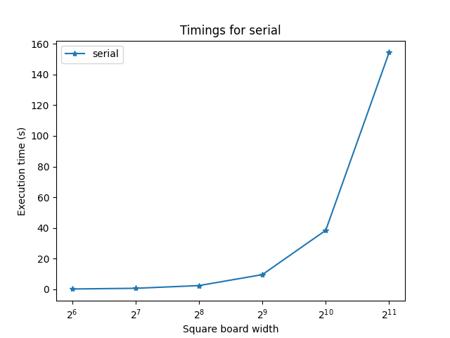
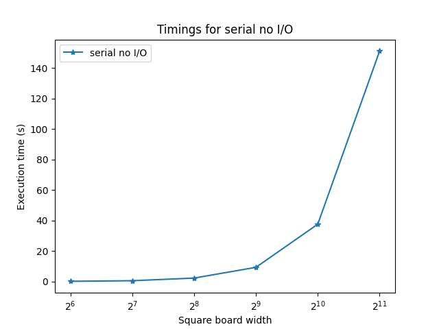

As the board size gets larger the I/O back up becomes more noticable, but this was the best I could get.

### Shared memory approach with OpenMP: `omp_game.c`
For this implementation I used OpenMP to help manage the shared memory environment. This was the easiest to implement as the loops were easy to make parallel using the `for` pragmas.

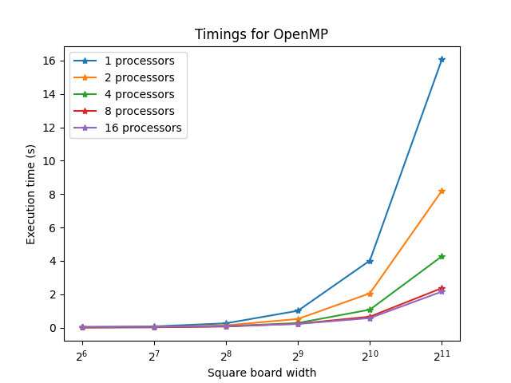
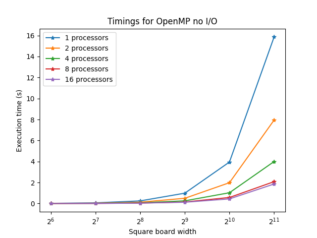

One thing that emediatly stood out to me was how much faster the single threaded OpenMP implementation was over the serial implementation. I expected them to take about the same amount of time. This implementation was about 10 times faster, but I don't know why this was the case.

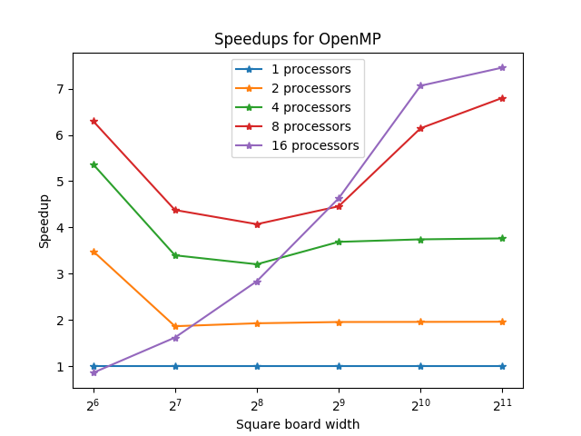
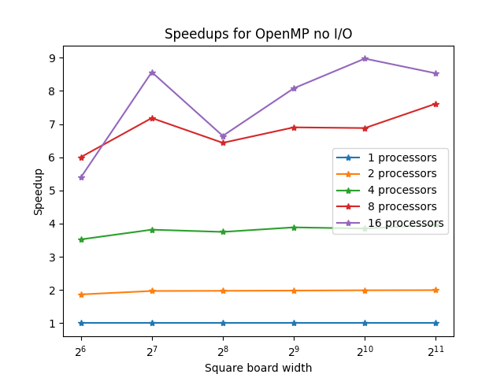

### GPU approach with Cuda: `cuda_game.cu`
For this implementation I used cuda to program gpu kernals. Managing the memory in this implementation was difficult and required me to be very careful with how I passes struct pointers around.

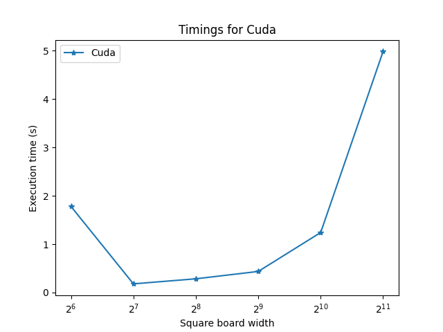
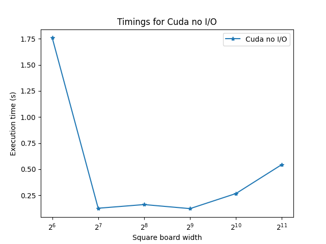

Overall this implementation wasn't as fast as I had hoped and, after looking at these graphs, it is painfuly clear that I am hitting an I/O bottleneck. 

### Distributed memory approach with MPI: `mpi_game.c`

This implementation was by far the most difficult to implement. My inital approach for this implementation involved tiling the board into smaller mini boards. This approach torned into a mess of confusing pointer arythmatic that made debugging exceptionaly difficult. The approach I ended up landing on had me iterating in steps and spliting the computation by rows and using `MPI_Allreduce` at the end of this step. I also could not figure out filling the video buffers using any distributed methods, so a huge bottleneck occurs during the video buffer writing step of the process.

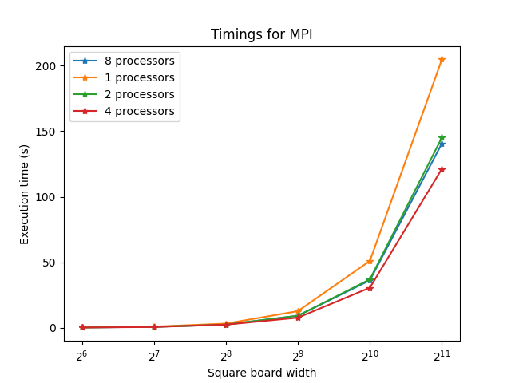
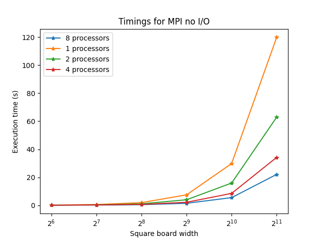

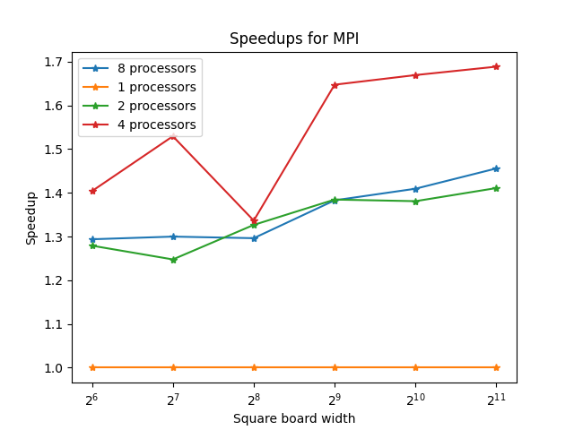
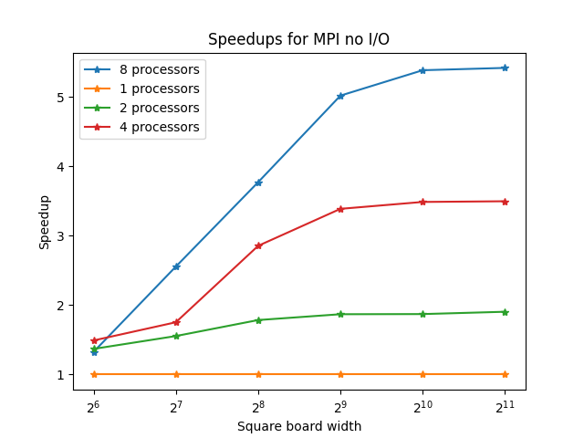
